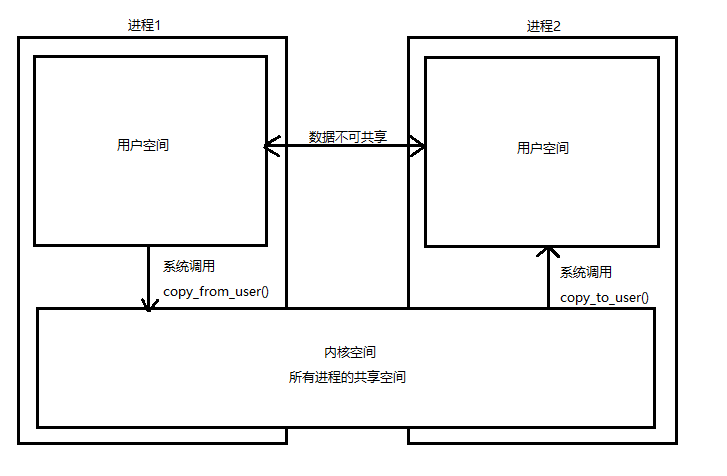

# Binder

### 1. Binder到底是什么

中文即 粘合剂，意思是粘合了两个不同的进程。

**Binder优点**：

1. 传输效率高，可操作性强：传输效率主要影响因素是内存拷贝的次数，拷贝次数越少，传输速率越高。从Android进程架构角度分析：对于消息队列、Socket和管道来说，数据先从发送方的缓存区拷贝到内存开辟的缓存区中，再从内存缓存区拷贝到接收方的缓存区，一共拷贝两次。对于Binder来说，数据从发送方的缓存区拷贝到内核的缓存区，而接收方的缓存区与内核的缓存区是映射到同一块物理地址的，节省了一次数据拷贝的过程。
2. 实现C/S结构方便：Linux的众IPC方式除了Socket以外都不是基于C/S架构的，而Socket主要用于网络间的通信且传输效率较低。Binder是基于C/S架构，Server端与Client端相对独立，稳定性好。
3. 安全性高：传统Linux IPC的接收方无法获得对方进程可靠的UID / PID，从而无法鉴别对方身份；而Binder机制为每个进程分配了UID / PID且在Binder通信时会根据UID/PID进行有效性检测。

### 2. Linux知识

#### 2.1 进程空间划分

一个进程空间分为**用户空间**和**内核空间**（Kernel），即把进程内用户和内核隔离开来。

区别：

1. 进程间，用户空间的数据不可共享，所以**用户空间 = 不可共享空间**。
2. 进程间，内核空间的数据可共享，所以**内核空间 = 可共享空间**。

所以进程共用1个内核空间。

进程内用户空间和内核空间进行交互需通过**系统调用**，主要通过函数：

1. copy_from_user()：将用户空间的数据拷贝到内核空间。
2. copy_to_user()：将内核空间的数据拷贝到用户空间。

#### 2.2 进程隔离和跨进程通信（IPC）

- 进程隔离：为了保证安全性和独立性，一个进程不能直接操作或者访问另一个进程，即Android的进程是相互独立的、隔离的。
- 跨进程通信（IPC）：即进程间需进行数据交互、通信。

跨进程通信：

工作流程：

1. 发送进程通过系统调用，将需发送的数据拷贝到Linux进程的内核空间中的缓存区中（第1次数据拷贝，通过`copy_from_user()`）。
2. 内核服务程序唤醒接收进程的接收线程，通过系统调用将数据发送到接收进程的用户空间，最终完成数据发送（第2次数据拷贝，通过`copy_to_user()`）。

缺点：

1. 效率低下，因需做2次数据拷贝，用户空间 -> 内核空间 -> 用户空间。
2. 接收数据的缓存由接收方提供，但接收方却不知道到底有多大的缓存才能满足需求。

Binder的作用：连接两个进程，实现了`mmap()`系统调用，主要负责创建数据接收的缓存空间和管理数据接收缓存。

传统的跨进程通信需拷贝数据2次，但Binder机制只需1次，主要是使用了内存映射。

#### 2.3 内存映射

