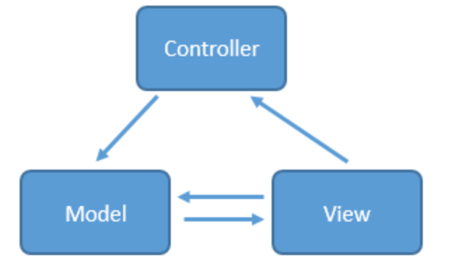

# MVC、MVP 、MVVM架构

### 一、MVC

MVC，全名是Model-View-Controller，是模型(model)－视图(view)－控制器(controller)的缩写，一种软件设计典范，用一种业务逻辑、数据、界面显示分离的方法组织代码，在改进和个性化定制界面及用户交互的同时，不需要重新编写业务逻辑。 

简单来说，就是Cotroller层去操作Model层的数据，并且返回给View层显示。

**工作原理**：当用户触发事件的时候，View层会发送指令到Cotroller层，紧接着Cotroller去通知Model层更新数据，Model层更新完数据之后直接显示在View层上。

- View：界面显示。
- Model：处理数据，业务逻辑。
- Cotroller：View和Model的桥梁，来达到分离视图显示和业务逻辑。

**Android项目中**：

- View：对应layout.xml。
- Model：对应Bean、Responsitory，处理业务逻辑。
- Controller：对应Activity，不在这里写业务代码，交给Model层处理业务逻辑。

**实际应用场景**：

点击按钮下载文件，按钮是View层，网络相关的操作放在Model层中，通过`button. setOnClickListener()`连接两者，就写在了Activity中，对应Controller层。

**缺点**：

1. View层控制能力太弱，如果想动态改变背景、动态隐藏显示一个按钮，这些在XML都实现不了，只能把代码写在Activity中，造成了Activity既是Controller，又是View的困境。
2. View和Model是相互可知的，存在耦合。
3. Activity并不是一个标准的Controller，它的首要职责是加载应用的布局和初始化页面，并接受和处理来自用户的操作请求，进行做出相应。 随着界面及其逻辑的复杂度不断提升，Activity类的职责不断增加，以致变得庞大臃肿。 

### 二、MVP

MVP作为MVC的演化，解决了不少的缺点，对于Android来说，MVP的Model层与MVC的一样，而Activity/Fragment不再是Controller，而是View层，所有关于用户事件转发全部交给Presenter层处理。

**工作原理**：

- View：界面显示。
- Model：处理数据，业务逻辑。
- Presenter：View和Model的中间纽带，来达到分离视图显示和业务逻辑。

**Android项目中**：

- View：对应于layout.xml + Activity/Fragment。
- Model：对应Bean、Responsitory，处理业务逻辑。
- Presenter：作为View与Model交互的中间纽带，从Model拿数据，应用到UI层，管理UI的状态，响应用户的行为。

**优点**：

1. **分离视图与业务逻辑**：在Presenter中持有View的引用，然后在Presenter中调用View暴露的接口对视图进行操作，分离了视图和业务逻辑，降低了耦合。
2. **Activity/Fragment成为真正View**：MVP能够让Activity称为真正的View而不是View和Controller的合体，Activity只需要做UI相关的事，代码变得更加简洁。
3. **接口抽象**：View逻辑和业务逻辑分别抽象到View和Presenter的接口中去，提高代码的可阅读性。
4. **单元测试**：Presenter被抽象成接口，可以有多种具体的实现，方便进行单元测试。
5. **避免异常**：把业务逻辑抽象到Presenter中去，避免后台线程引用着Activity导致Activity的资源无法被系统回收从而引起内存泄露和OOM。

**缺点**：

1. **View和Presenter大量互相回调**：Activity需要实现各种和UI相关的接口，同时要在Activity中编写大量的事件，然后在事件处理中调用Presenter的业务处理方法，View和Presenter只是互相持有引用并互相做回调，代码不美观。
2. **视图和逻辑耦合性太高**：程序的主角是UI，通过UI的事件触发对数据进行处理，更新UI就有考虑线程的问题。而且UI改变后牵扯的逻辑耦合度太高，一旦控件更改，牵扯的更新UI的接口就必须得更换。
3. **Presenter臃肿**：复杂的业务同时会导致Presenter层太大，代码臃肿的问题。
4. **增加了太多的类和接口**。

### 三、MVVM

看起来和MVP区别不大，只不过是Presenter换成ViewModel层，ViewModel和View是相互绑定的，更新ViewModel层数据的时候，UI会做出相应的变动。

利用数据绑定（Data Binding）、依赖属性（Dependency Property）、命令（Command）、路由事件（Routed Eent）等特性，打造一个更加灵活高效的架构。

优点：

1. **数据驱动**：以前开发模式中必须先处理业务数据，然后根据数据变化，去获取UI的引用然后更新UI，同时也是通过UI来获取用户输入，而在MVVM中，数据和业务逻辑处于一个独立的ViewModel中，ViewModel只关注数据与业务逻辑，不需要和UI或者控件打交道。由数据自动去驱动UI去自动更新UI，UI的改变又同时自动反馈到数据，数据成为主导因素，这样使得在业务逻辑处理时只要关心数据，方便而且简单很多。
2. **低耦合度**：MVVM模式中，数据是独立于UI的，ViewModel只负责处理和提供数据，UI想怎么处理数据都由UI自己决定，ViewModel不涉及任何和UI相关的事也不持有UI控件的引用，即使控件改变（TextView换成EditText），ViewModel几乎不需要更改任何代码，专注于自己的数据处理就可以。如果是MVP遇到UI更改，就可能需要改变获取U的方式，改变更新UI的接口，改变从UI上获取输入的代码，可能还需要更改访问UI对象的属性代码等。
3. **更新UI**：在MVVM中，可以从工作线程中直接修改ViewModel的数据（只要数据是线程安全的），剩下的数据绑定框架帮你搞定，很多事情都不用关心。
4. **团队协作**：MVVM的分工是非常明显的，由于View和ViewModel之间是松散耦合的， 一个处理业务和数据，一个是专门的UI处理。完全由两个人分工来做，一个做UI（xml和Activity），一个写ViewModel，效率更高。
5. **可复用性**：一个ViewModel复用到多个View中，同样的一份数据，用不同的View去做展示，对于版本迭代频繁的UI改动，只需要更改View层就行。
6. **单元测试**：ViewModel里面是数据和业务逻辑，View中关注的是UI，这样做测试是很方便的，完全没有彼此的依赖，UI和业务逻辑的单元测试都是低耦合的。