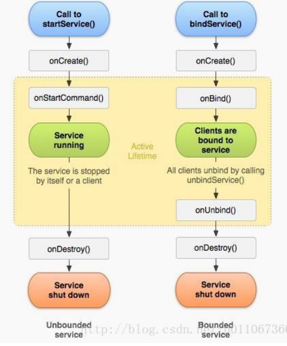

# Service全方位解析

### 一、Service简介

Service是Android中实现程序后台运行的解决方案，非常适用于执行那些不需要和用户交互而且还要长期运行的任务，是四大组件之一。

Service默认并不会运行在子线程中，也不会运行在一个独立的进程中，同样执行在UI线程中。因此，不要在Service中执行耗时的操作，除非在Service创建子线程来完成耗时任务。

### 二、Service种类

按运行地点分类：

| 类别                       | 区别                 | 优点                                                         | 缺点                                                         | 应用                                           |
| -------------------------- | -------------------- | ------------------------------------------------------------ | ------------------------------------------------------------ | ---------------------------------------------- |
| 本地服务（Local Service）  | 该服务依附于主线程上 | 服务依附主进程上而不是独立的进程，这样在一定程度上节约了资源，另外Local服务因为是在同一进程因此不需要IPC，也不需要AIDL，相应bindService方便很多。 | 主进程被kill后，服务便会终止                                 | 音乐播放器等不需要常驻的服务                   |
| 远程服务（Remote Service） | 该服务是独立的进程   | 服务为独立的进程，对应进程名格式为android:process字符串。由于是独立的进程，因此在Activity所在进程被kill的时候，该服务依然运行，不受其他进程影响，有利于为多个进程提供服务具有较高的灵活性。 | 该服务是独立的进程，会占用一定的资源，并且使用AIDL进程IPC稍微麻烦一点 | 一些提供系统服务的Service，这种Service是常驻的 |

按运行类型分类：

| 类别     | 区别                                                         | 应用                                                         |
| -------- | ------------------------------------------------------------ | ------------------------------------------------------------ |
| 前台服务 | 会在通知栏显示onGoing的Notification                          | 当服务被终止的时候，通知一栏的Notification也会消失，这样对于用户有一定的通知作用，常见的如音乐播放器 |
| 后台服务 | 默认的服务即为后台服务，即不会在通知一栏显示onGoing的Notification | 当服务被终止的时候，用户是看不见效果的，某些不需要运行或终止的服务，如天气更新，日期同步，邮件同步等 |

按使用方式分类：

| 类别                                        | 区别                                                      |
| ------------------------------------------- | --------------------------------------------------------- |
| startService                                | 主要用于启动一个服务执行后台任务，停止服务使用stopService |
| bindService                                 | 方法启动的服务要进行通信，停止服务使用unbindService       |
| 同时使用startService，bingService启动的服务 | 停止服务使用stopService与unbindService                    |

### 三、Service生命周期

**onCreate()：**

系统在Service第一次创建时创建此方法，来执行只运行一次的初始化工作。如果Service已经运行，这个方法不会再被调用。

**onStartCommand()：**

每次客户端调用startService()方法启动该Service都会回调该方法（多次调用）。一旦这个方法执行，service就执行并且在后台长期执行。通过stopService()和stopSelf()来停止服务。

注意：

onStartCommand()必须返回一个整数，描述系统在杀死服务后应该如何继续运行：

- START_NOT_STICKY：不会重建服务，除非还存在未发送的intent。当服务不再是必须的，并且应用程序能够简单地重启那些未完成的工作，这是避免服务运行的最安全的选项。
- START_STICKY：重建服务，调用onStartCommand()，但不会再次送入上一个intent，而是用null intent来调用onStartCommand()。除非还有启动服务的intent未发送完，那么这些剩下的intent会继续发送（适用于媒体播放器类似服务，它们不执行命令，但需要一直运行并随时待命）。
- START_REDELIVER_INTENT：重建服务，用上一个已送过的intent调用onStartCommand()。任何未发送完的intent也都会依次送入（适用于那些需要立即恢复工作的活跃服务，比如下载文件）。

**onBind()：**

当组件调用bindService()想要绑定到service时（比如想要执行进程间通讯）系统调用此方法（一次调用，一旦绑定后，下次再调用bindService()就不会回调该方法）。在实现中，必须提供一个但会一个IBinder来使客户端能够使用它与service通讯，必须实现这个方法，如果不允许绑定，那么应返回null。

**onUnbind()：**

当前组件调用unBindService()，想要解除与service的绑定时系统调用此方法（一次调用，一旦解除绑定后，下次再调用unbindService()会抛出异常）。

**onDestroy()：**

系统在service不再被使用并要销毁时调用此方法（一次调用）。Service应在此方法中释放资源，比如线程，已注册的侦听器，接收器等，这是Service收到的最后一个调用。

AndroidManifest里声明Service：

| 属性               | 说明                                         | 备注                                                 |
| ------------------ | -------------------------------------------- | ---------------------------------------------------- |
| android:name       | Service的类名                                |                                                      |
| android:label      | Service的名字                                | 若不设置，默认为Service类名                          |
| android:icon       | Service的图标                                |                                                      |
| android:permission | Service的权限                                | 有提供了该权限的应用才能控制或连接此服务             |
| android:process    | 表示该服务是否在另一个进程中运行（远程服务） | 不设置默认为本地服务；remote则设置为远程服务         |
| android:enabled    | 系统默认启动                                 | true：Service将会默认被系统启动；不设置则默认为false |
| android:exported   | 该服务能否被其它应用程序所控制或连接         | 不设置默认此项为false                                |

#### 三种不同情况下的Service的生命周期情况：

##### 1.startService/stopService

生命周期顺序：onCreate() -> onStartCommand() -> onDestroy()

如果一个Service被某个Activity调用startService方法启动，不管是否有Activity使用bindService或unbindService解除绑定到该Service，该Service都在后台运行，知道被调用stopService，或自身的stopSelf方法。当然如果系统资源不足，android系统也可能结束服务，还有一种就是在手机设置中找到应用关闭。

注意：

1. 第一次startService会触发onCreate和onStartCommand，以后在服务运行过程中，每次startService都只会触发onStartCommand。
2. 不论startService多少次，stopService一次就会停止服务。

##### 2.bindService/unbindService

生命周期顺序：onCreate() -> onBind() -> onUnBind() -> onDestroy()

如果一个Service在某个Activity中被调用bindService方法启动，不论bindService被调用几次，Service的onCreate只会执行一次，同时onStartCommand方法始终不会被调用。

当建立连接后，Service会一直运行，除非调用unbindService来讲解除绑定、断开连接或调用该Service的Context不存在了，这时系统会自动通知该Service。

注意：

1. 第一次bindService会触发onCreate和onBind，以后在服务启动过程中，每次bindService都不会触发任何回调。

##### 3.混合型（上面两种方式的交互）

同时startService和bindService时，必须先调用unBindService后再stopService才会停止服务。

### 四、远程服务Service

#### 1. 远程服务与本地服务的区别

远程服务和本地服务最大的区别：远程服务Service与调用者不在同一个进程里（即远程Service是运行在另外一个进程）；而本地服务则是与调用者运行在同一个进程里。

#### 2. 使用场景

多个应用程序共享同一个后台服务（远程服务），即一个远程服务Service与多个应用程序的组件进行跨进程通信。

### 五、Service与Thread的区别

Service与Thread无任何关系，之所以把它们联系起来，主要是因为Service的后台概念。后台任务运行完全不依赖UI，即使Activity被销毁/程序被关闭，只要进程还在，后台任务就可继续运行。

一般会将Service和Thread联合着用，即在Service中再创建一个子线程（工作线程）去处理耗时操作逻辑。

### 六、IntentService