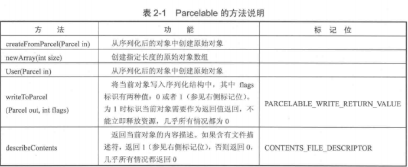

# 2.IPC机制

### 2.1 Android IPC简介

IPC是Inter-Process Communication的缩写，含义是进程间通信或跨进程通信，是指两个进程间进行互数据交换的过程。

在Android中最有特色的进程间通信就是Binder。Android还支持Socket，通过Socket可以实现两个终端之间的通信。

### 2.2 Android中的多进程模式

启动多进程模式：在Manifest中给四大组件指定android:process。

#### 2.2.1 开启多进程模式

正常情况下，在Android中多进程是指一个应用中存在多个进程的情况，这里不讨论应用间的多进程情况。除了指定android:process属性的方法，还有一种非常规的多进程方法，通过JNI在native层去fork一个新的进程，这属于特殊情况。

```xml
<activity
    android:name="com.ryg.chapter_2.MainActivity"
    android:configChanges="orientation|screenSize"
    android:label="@string/app_name"
    android:launchMode="standard">
    <intent-filter>
    	<action android:name="android.intent.action.MAIN"/>
        <category android:name="android.intent.category.LAUNCHER"/>
    </intent-filter>
</activity>
<activity
    android:name="com.ryg.chapter_2.SecondActivity"
    android:configChanges="screenLayout"
    android:label="@string/app_name"
    android:process=":remote"/>
<activity
    android:name="com.ryg.chapter_2.ThirdActivity"
    android:configChanges="screenLayout"
    android:label="@string/app_name"
    android:process="com.ryg.chapter_2.remote"/>
```

SecondActivity和ThirdActivity添加了两个新进程，当前包名为"com.ryg.chapter_2"，当SecondActivity启动时，系统会为它创建一个单独的进程，进程名为`com.ryg.chapter_2:remote`，当ThirdActivity启动时，系统也会为它创建一个单独的进程，进程名为`com.ryg.chapter_2.remote`。同时入口Activity为MainActivity，运行在默认进程中，默认进程名就是包名。

- ：是指在当前进程名前面附加上当前的包名，此进程是当前应用的私有进程，其他应用的组件不可以和它跑在同一个进程，进程名不以：开头的进程属于全局进程，其他应用可以通过ShareUID方法可以和它跑在同一进程个中。
- ThirdActivity是一种完整的命名方式，不会附加包名信息。

Android系统为每一个应用分配一个唯一的UID，具有相同UID的应用才能共享数据。两个应用通过ShareUID跑进同一个进程中需要两个应用具有相同的ShareUID并且相同才可以。

#### 2.2.2 多进程模式的运行机制


1.开启多进程模式：


<1>android:process=":remote" <2>android:process="com.example.chapter_2.remote"

<1>当前应用的私有进程（其它应用的组件不可以和它跑进同一个进程）

<2>全局进程（其它应用通过ShareUID方式可以和它跑进同一个进程）

Android为每个应用分配一个唯一的UID，有相同UID的应用才能共享数据。

2.多进程运行机制

多进程带来的主要影响：运行在不同进程中的四大组件，只要他们之间通过内存来共享数据，都会共享失败。

问题：

<1>静态成员和单例模式完全失效

<2>线程同步机制完全失效

<3>SharedPreferences的可靠性下降

<4>APPlication会多次创建

多进程模式中，不同进程的组件的确会拥有独立的虚拟机，Application和内存空间。

3.IPC基础

<1>Serializable接口

这是java提供的一个空的序列化接口，为对象提供标准序列化和反序列化操作。

实现序列化：声明`private static final long serialVersionUID = 8711368828010083044L;`

实现系列化方法：这个类实现Serializable接口，并声明serialVersionUID，实际上serialVersionUID也不是必须的，不声明这个同样会实现序列化，但这将对反序列化产生影响。

序列化和反序列化：

`public class User implents Serializable{`

`private static final long serialVersionUID = 519067123721295773L;`

`public int userId;`

`public String username;`

`public boolean isMale;`

`...`

`}`

序列化：

`User user = new User(0,"jake",true);`

`ObjectOutputStream out = new ObjectOutputStream (new FileOutputStream("cacahe.txt"));`

`out.writeObject(user);`

`out.close();`

反序列化：

`ObjectIntputStream in = new ObjectIntputStream (new FileIntputStream("cache.txt"));`

``User newuser = (User)in.readObject();`

`in.close();`

serialVersionUID 作用机制：

序列化的时候，系统会把当前类的serialVersionUID写入序列化的文件中，当反序列化的时候，系统会去检测文件中的serialVersionUI是否和类中的一致，如果一致，反序列化成功，否则，说明当前类与序列化的类发生了变化，无法反序列化。

若不手动指定serialVersionUID的值，系统会根据类的结构生成他的hash值，若类发生变化，hash值会发生变化，反序列化会失败。

**注意**：

​	**<1>static变量属于类不属于对象，所以不参与序列化过程。**

​	**<2>用transient关键字标记的成员变量不参与序列化过程。**

另外：系统的序列化过程可以改变，重写writeObject()和readObject()即可。

<2>Parcelable接口

实现此接口，对象就可实现序列化并通过Intent和Binder传递。

`public class User implents Serializable{`

`public int userId;`

`public String username;`

`public boolean isMale;`

`publicv Book book;`

`public User(int userId,String username,boolean isMale){`

​	`this.userId=userId;`

​	`this.username=username;`

​	`this.isMale=isMale;`

`}`

`public int describeContents(){`

​	`return 0;`

`}`

`public void writeToParcel(Parcel out,int flags){`

​	`out.writeInt(userId);`

​	`out.writeString(username);`

​	`out.writeInt(isMale?1:0);`

​	`out.writeParcelable(book,0);`

`}`

`public static final Parcel.Creator<User> CREAOR=new Parcelable.Creator<User>(){`

​	`public User createFromParcel(Parcel in){`

​		`return new User(in);`

​	`}`

​	`public User[] newArray(int size){`

​		`return new User[size];`

​	`}`

`};`

`private User(Parcel in){`

​	`userId=in.readInt();`

​	`userName=in.readString();`

​	`isMale=in.readInt()==1;`

​	`book=in.readParcelable(Thread.currentTherad().getContextClassLoader());`

`}`

`}`

Parcel：内部包装了可序列化的数据，可在Binder中自由传输。

序列化：writeToParcel(),最终通过Parcel中write方法完成。

反序列化：CREATOR,内部标明了如何创建序列化对象和数组，并通过Parcel的中read方法完成。

内容描述：describeContent()，几乎在所有情况下都return 0，仅当当前对象中存在文件描述符时，return 1。

**注意**：**在User(Parcel in)中，由于book时另一个可序列化对象，所以它的反序列过程需要传递当前线程的上下文类加载器，否则报无法找到类的错。**



系统提供了许多实现了Parcelable的类，它们可以直接序列化，例如：Intent，Bundle，Bitmap，List和Map也可序列化，前提是它们里边每个元素都是可序列化的。

**两者优缺点**：

Serializable是java中的序列化接口，简单但开销大，需要大量的IO操作。

Parcelable是Android中的序列化方式，效率高，但麻烦。

首选Parcelable。

Parcelable用在内存序列化上，将对象序列化在存储设备中或将对象序列化后通过网络传输也可以，但稍显复杂，这时建议用Serializable。

<3>Binder

Binder是Android中的一个类，实现了IBinder接口。Binder是Android中的一种跨进程通信方式，Binder还可理解为一种虚拟物理设备，它的设备驱动是/dev/binder，该通信方式在Linux中没有。

Android Framework方面：Binder是ServiceManager连接各种Manager和相应ManagerService的桥梁。

Android应用层方面：Binder是客户端和服务端通信的媒介。

Android开发中，Binder主要用于Service，也包括AIDL和Messager。

普通Service中的Binder不涉及进程间通信，故较为简单。

Messager底层是AIDL。

